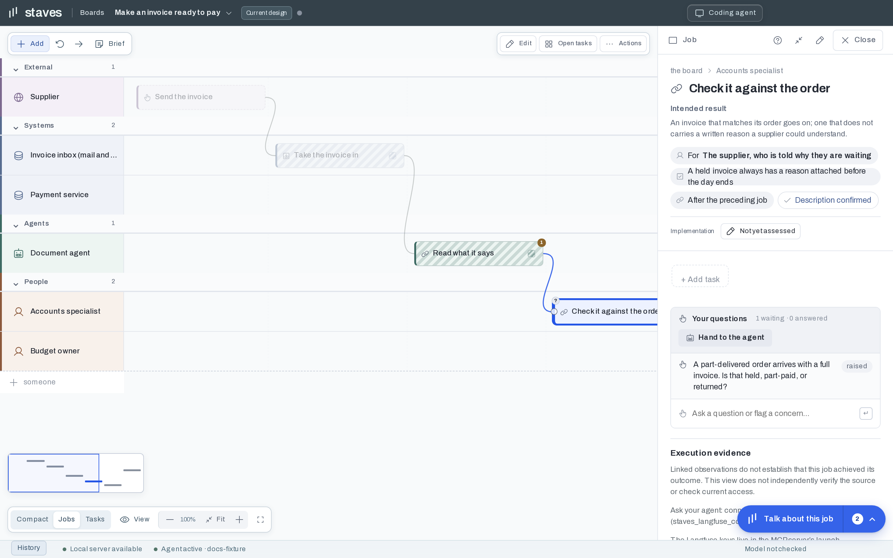

A **job** describes something achieved for a person. Its **tasks** describe the work needed to achieve it. Tasks can belong to different roles, including people, agents and systems.

**Tracks** keep those responsibilities visible. **Connections** describe handoffs between jobs. An **epic** groups related work without replacing its jobs or owners.

Zoom out for the overall shape and in for detail. Collapse track groups to keep supporting work compact; select an item in a stack to reveal its role and inspect it.
