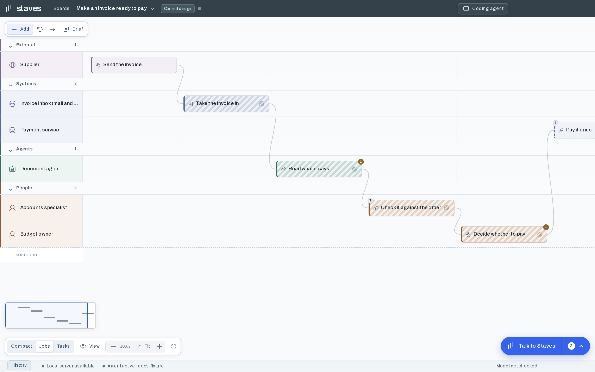

A board makes one claim: *this is how the work happens.* Everything on it exists to make that claim
checkable.

## Tracks — who contributes

A track is a contributor, down the left. There are four kinds, and the distinction matters because
it decides who can be *waiting* on something:

| Kind | Who that is |
| --- | --- |
| **person** | Someone inside the organisation doing the work |
| **agent** | A model doing work on someone's behalf |
| **system** | Software that runs without judgement — a queue, a database, an API |
| **outside** | Someone beyond the organisation: a customer, a supplier, a regulator |

## Jobs — what someone gets

A **job** is named by what a person has when it is done. Someone is waiting on it, and that someone
is a person or an outside party — never a system. "Check it against the order", not
"validateInvoice".

If only another *step* waits on it, it is not a job. It is a **task** inside one.

Each job can carry:

- **Intended result** — what is different when it is done
- **Who needs the result** — the person waiting, and what they do with it next
- **How you know it is complete** — what you would actually check
- **Why** — the rationale, in the words of whoever explained it

A job with none of these is a **draft**: Staves keeps it and hands back the questions rather than
refusing it.

## Tasks — the work inside a job

Tasks belong to a job and can sit on different tracks from it. That is the point: the job "Check it
against the order" may contain an agent reading the document, a system matching it, and a person
deciding — three tracks, one outcome.

## Handoffs — what passes

Handoffs are **never drawn directly**. They are derived from each job's inputs and outputs, from its
exit targets, and from where a loop goes back. If two jobs are joined on the canvas, it is because
the board says so somewhere else — which means the line cannot lie about the flow.

Artifacts are what passes, and they have kinds: `document`, `data`, `decision`, `message`,
`record`, `instruction`, `measure`, `other`. An artifact marked **external** came from outside.

## Triggers — what starts it

| Trigger | Meaning |
| --- | --- |
| `hand` | A person gets to it |
| `ask` | Someone asks for it |
| `event` | Something arrives |
| `chain` | The previous job ends |
| `clock` | A schedule |
| `watch` | A condition becomes true |
| `deadline` | Time runs out |
| `always` | It never stops |
| `other` | Said in words instead |

Trigger is worth arguing about. `hand` and `chain` look the same on a canvas and feel completely
different to the person waiting: one means *when someone gets round to it*, the other means
*immediately*.

## Gates — where judgement happens

A gate is a decision point: the rule in words, and who is **accountable** for it — a track, or
`rule` when a rule decides rather than a person. A gate is how a board shows where human judgement
is actually required, as opposed to where it merely happens to be.

## Status, and what is actually built

Two different things, deliberately kept apart:

- **Status** — `draft` until a person signs it off, `confirmed` after. A confirmed job is never
  silently redrawn; a re-description comes back as a proposal.
- **Implementation** — `unknown`, `planned`, `in-progress`, `implemented`. This is about the code,
  not the description. It is how a board shows intent without pretending intent has shipped.

## Questions and findings

A **question** is something nobody knows, attached to the job it concerns. A board with no
questions usually means something was invented rather than found.

A **finding** is something Staves noticed: jargon, a job reached from two places, work that
produces something and checks nothing.

## Stale

A job is stale when the files it was described from have changed since. It does not mean the
description is wrong — only that nobody has checked. See
[picking a board back up](/docs/how-to/resume/).
